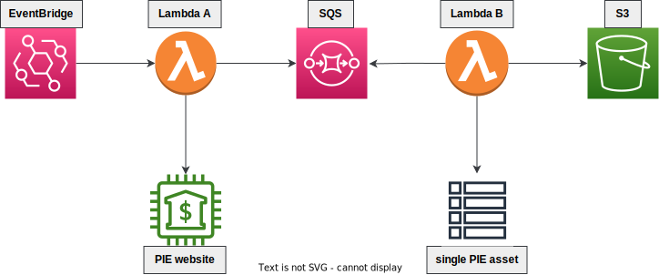

# Pipeline to etl PIE MIK data

## Project description

The aim of the project is to download the results of business cycle research. The data is published once a month in the form of MIK index (Miesięczny Indeks Koniunktury). The index is a product of cooperation between Polski Instytut Ekonomiczny (PIE) and Bank Gospodarstwa Krajowego (BGK).

## Architecture



1. EventBridge triggers Lambda A once a month
2. Lambda A downloads links for further processing from PIE-MIK website
3. Lambda A sends message batch to SQS with links
4. Lambda B is invoked when links are pushed to SQS queue
5. Each instance of Lambda B downloads one file from a given link
6. Each instance of Lambda B uploads its file to S3

## How to deploy?

```shell
bash package.sh
cd terraform
terraform apply
```

You will be asked for AWS access key and secret key

## How to test?

```shell
pytest
```
